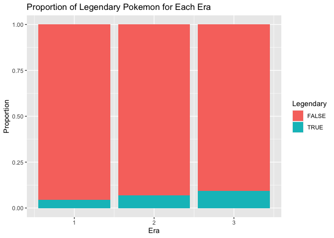
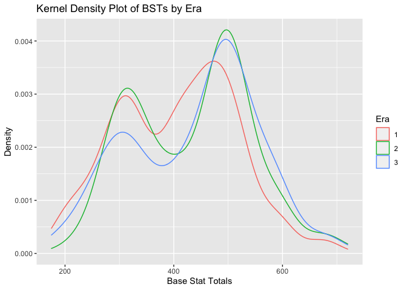
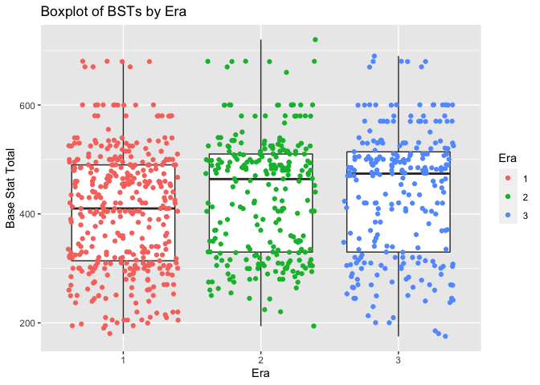
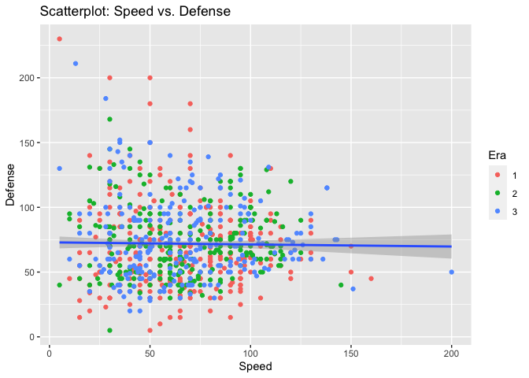

Pokemon Data API Vignette
================
Collin Knezevich
6/19/2022

# Pokemon Data API Vignette

In this vignette, I will walk you through how to read data from [this
Pokemon data API](https://pokeapi.co/). I will be creating functions to
easily query data from the API, in such a way that it will be easy to
call the function and query specific data.

Additionally, [here](https://github.com/cmknezev/ST-558-Project-1) is
the link to my Github repository.

## Required Packages

In order to query data from the Pokemon API, we will need the following
packages:

-   `tidyverse`  
-   `httr`  
-   `jsonlite`

## Functions

### Pokemon Function

The Pokemon API stores data about a specific Pokemon in two different
places (both containing different info): a general “Pokemon” location,
and a “Pokemon Species” location. This first function will query data
from the former.

The `returnPkmn` function takes either the ID number of a Pokemon, or
the name of a Pokemon (as a string), as its input. It will return a data
frame with the following relevant information from this location in the
API:  
- *Name:* the name of the Pokemon  
- *ID:* the ID number of the Pokemon  
- *Type1:* the primary type of the Pokemon  
- *Type2:* the secondary type of the Pokemon, if applicable (will return
NA if Pokemon does not have secondary type)  
- *HP:* base HP stat  
- *Attack:* base Attack stat  
- *Defense:* base Defense stat  
- *SpAttack:* base Special Attack stat  
- *SpDefense:* base Special Defense stat  
- *Speed:* base Speed stat

``` r
returnPkmn <- function(idName){ 
  # set up URL for paste functions 
  startURL <- "https://pokeapi.co/api/v2/pokemon/" 
  endURL <- "/" 
  
  # if id specified 
  if (typeof(idName) == "double"){ 
    apiDat <- GET(paste0(startURL, as.character(idName), endURL)) 
    rawDat <- rawToChar(apiDat$content) 
    fullDat <- fromJSON(rawDat) 
  } 
  
  # if name specified 
  else if (typeof(idName) == "character"){ 
    name <- tolower(idName) 
    apiDat <- GET(paste0(startURL, name, endURL)) 
    rawDat <- rawToChar(apiDat$content) 
    fullDat <- fromJSON(rawDat) 
  } 
  
  # error control - if input improperly specified 
  else { 
    stop("Input incorrectly specified.") 
  } 
  
  # constructing data frame with relevant information 
  df <- data.frame(Name = fullDat$name, 
                   ID = fullDat$id, 
                   Type1 = fullDat$types$type$name[1],
                   Type2 = fullDat$types$type$name[2],
                   HP = fullDat$stats$base_stat[1], 
                   Attack = fullDat$stats$base_stat[2], 
                   Defense = fullDat$stats$base_stat[3], 
                   SpAttack = fullDat$stats$base_stat[4], 
                   SpDefense = fullDat$stats$base_stat[5], 
                   Speed = fullDat$stats$base_stat[6]) 
  return(df) 
}
```

### Species Function

The `returnPkmnSpecies` function takes in either the ID number of a
Pokemon, or the name of a Pokemon, as its input. It will return a data
frame with the following particularly relevant information from the
API:  
- *Name:* the name of the Pokemon  
- *ID:* the ID number of the Pokemon  
- *Gen:* the generation in which the Pokemon first appeared  
- *PreEvo:* the Pokemon from which the queried Pokemon evolved from
(returns NA if no pre-evolution)  
- *EggGrp1:* the first egg group of the Pokemon  
- *EggGrp2:* the second egg group of the Pokemon, if applicable  
- *Legendary:* a boolean to say whether or not the Pokemon is a
legendary  
- *Mythical:* a boolean to say whether or not the Pokemon is a mythical

``` r
# Pokemon species function 
returnPkmnSpecies <- function(idName){ 
  # set up URL for paste functions 
  startURL <- "https://pokeapi.co/api/v2/pokemon-species/"
  endURL <- "/"
  
  # if id specified 
  if (typeof(idName) == "double"){ 
    apiDat <- GET(paste0(startURL, as.character(idName), endURL)) 
    rawDat <- rawToChar(apiDat$content) 
    fullDat <- fromJSON(rawDat) 
  } 
  
  # if name specified 
  else if (typeof(idName) == "character"){ 
    name <- tolower(idName) 
    apiDat <- GET(paste0(startURL, name, endURL)) 
    rawDat <- rawToChar(apiDat$content) 
    fullDat <- fromJSON(rawDat) 
  } 
  
  # error control - if input improperly specified 
  else { 
    stop("Input incorrectly speficied.")
  } 
  
  # constructing data frame with relevant information 
  df <- data.frame(Name = fullDat$name, 
                   ID = fullDat$id,  
                   Gen = fullDat$generation$name, 
                   PreEvo = ifelse(is.null(fullDat$evolves_from_species$name), 
                                   NA, fullDat$evolves_from_species$name),
                   EggGrp1 = fullDat$egg_groups$name[1], 
                   EggGrp2 = fullDat$egg_groups$name[2],
                   Legendary = fullDat$is_legendary, 
                   Mythical = fullDat$is_mythical) 
  return(df)
}
```

### Move Function

The `returnMove` function will take in a move (as a string) as its
input, and will return the following information about the move:  
- *Move:* the name of the move  
- *Power:* the base power of the move (0 if move does not deal damage)  
- *Accuracy:* accuracy of the move - % chance of landing  
- *PP:* the PP of the move - \# of times move can be used  
- *Priority:* the priority of the move, which determines if the move
goes sooner/later than normal  
- *Type:* the type of the move  
- *DmgType:* the type of damage dealt by the move: physical, special, or
status

``` r
# Move function 
returnMove <- function(move){ 
  # convert input to lowercase, and replace spaces with dashes 
  move <- tolower(move) 
  move <- gsub(" ", "-", move) 
  
  # set up URL for paste functions 
  startURL <- "https://pokeapi.co/api/v2/move/"
  endURL <- "/"  
  
  apiDat <- GET(paste0(startURL, move, endURL)) 
  rawDat <- rawToChar(apiDat$content) 
  fullDat <- fromJSON(rawDat) 
  
  df <- data.frame(Move = fullDat$name, 
                   Power = ifelse(is.null(fullDat$power), 0, fullDat$power),
                   Accuracy = fullDat$accuracy, 
                   PP = fullDat$pp, 
                   Priority = fullDat$priority, 
                   Type = fullDat$type$name, 
                   DmgType = fullDat$damage_class$name) 
  return(df)
}
```

### Location Function

The `returnLocation` function will take in the name of a location (as a
string) as its input, and wil return the following information about the
location:  
- *Location:* the name of the location  
- *Region:* the region in which the location is located  
- *Generation:* the generation in which the location first appeared

``` r
returnLocation <- function(name){ 
  # convert input to lowercase, and replace spaces with -'s
  name <- tolower(name) 
  name <- gsub(" ", "-", name) 
  
  # set up URL for paste functions 
  startURL <- "https://pokeapi.co/api/v2/location/"
  endURL <- "/" 
  
  apiDat <- GET(paste0(startURL, name, endURL)) 
  rawDat <- rawToChar(apiDat$content) 
  fullDat <- fromJSON(rawDat) 
  
  df <- data.frame(Location = fullDat$name, 
                   Region = fullDat$region$name, 
                   Generation = fullDat$game_indices$generation$name) 
  return(df)
}
```

### Item Function

The `returnItem` function will take in either the ID number for an item,
or the name of an item (as a string), as its input. It will return the
following information about the item:  
- *Item:* the name of the item  
- *Cost:* how much the item costs, if applicable  
- *Type:* the use or category of the item  
- *Effect:* short explanation of what the item does

``` r
returnItem <- function(idName){ 
  # set up URL for paste functions 
  startURL <- "https://pokeapi.co/api/v2/item/" 
  endURL <- "/" 
  
  # if id specified 
  if (typeof(idName) == "double"){ 
    apiDat <- GET(paste0(startURL, as.character(idName), endURL)) 
    rawDat <- rawToChar(apiDat$content) 
    fullDat <- fromJSON(rawDat) 
  } 
  
  # if name specified
  else if (typeof(idName) == "character"){ 
    name <- tolower(idName) 
    name <- gsub(" ", "-", name) 
    apiDat <- GET(paste0(startURL, name, endURL)) 
    rawDat <- rawToChar(apiDat$content) 
    fullDat <- fromJSON(rawDat) 
  } 
  
  # error control if input improperly specified 
  else { 
    stop("Input improperly specified.") 
  } 
  
  df <- data.frame(Item = fullDat$name, 
                   Cost = fullDat$cost, 
                   Type = fullDat$category$name, 
                   Effect = fullDat$effect_entries$short_effect)
  return(df)
}
```

### Technical Machines Function

Technical Machines (TMs) are items you can use to teach your Pokemon a
move - the `returnTM` function will take the ID number for a TM as its
input, and will return the following information about the TM:  
- *ID:* the ID number associated with this TM  
- *Name:* the name of the TM  
- *Move:* the move taught by the TM  
- *Game:* the game in which the TM appears

``` r
returnTM <- function(id){ 
  # set up URL for paste functions 
  startURL <- "https://pokeapi.co/api/v2/machine/"
  endURL <- "/" 
  
  apiDat <- GET(paste0(startURL, as.character(id), endURL)) 
  rawDat <- rawToChar(apiDat$content)
  fullDat <- fromJSON(rawDat) 
  
  df <- data.frame(ID = fullDat$id, 
                   Name = fullDat$item$name, 
                   Move = fullDat$move$name, 
                   Game = fullDat$version_group$name) 
  return(df)
}
```

## EDA

Throughout this Exploratory Data Analysis exercise, I will be comparing
the attributes of Pokemon across different “eras” of Pokemon games. The
eras are defined as follows:  
- *Era 1:* Games released on the Game Boy (Generations 1-3)  
- *Era 2:* Games released on the DS (Generations 4 & 5)  
- *Era 3:* Games released on the 3DS or Switch (Generations 6-8)

### Data Preparation

First, we will obtain data on all Pokemon from the Pokemon and Pokemon
Species endpoints, and combine the two datasets.

``` r
# query from Pokemon endpoint
pkmn <- lapply(X = as.list(as.double(seq(1, 898))), FUN = returnPkmn) %>% 
  bind_rows()

# query from Species endpoint 
pkmnSpec <- lapply(X = as.list(as.double(seq(1, 898))), FUN = returnPkmnSpecies) %>% 
  bind_rows()

# removing Name column from second query - redundant information 
pkmnSpec <- pkmnSpec %>% select(-Name)

# merging two queries on Pokemon name 
allPkmn <- merge(pkmn, pkmnSpec, by = "ID")
```

Now, we will create two new variables based on the information in this
data frame. First, we will create the “Era” variable, based on a
Pokemon’s generation, as specified above. Second, we will create “BST” -
Base Stat Total - the sum of a Pokemon’s base stats (HP, Attack,
Defense, SpAttack, SpDefense, Speed). This will give an estimate of a
Pokemon’s overall level of strength.

``` r
# creating era variable
allPkmn <- allPkmn %>% 
  mutate(Era = if_else(Gen == "generation-i", 1, 
               if_else(Gen == "generation-ii", 1, 
               if_else(Gen == "generation-iii", 1, 
               if_else(Gen == "generation-iv", 2, 
               if_else(Gen == "generation-v", 2, 3))))))

# creating BST variable 
allPkmn <- allPkmn %>% 
  mutate(BST = (HP + Attack + Defense + SpAttack + SpDefense + Speed))
```

Now we are ready to begin our analysis. We will start by creating some
contingency tables.

### Contingency Tables

First, we will create a table to show how many Pokemon are in each Era
that we have defined.

``` r
table(allPkmn$Era)
```

    ## 
    ##   1   2   3 
    ## 386 263 249

The table shows us that there are fewer Pokemon in each new Era. It is
notable that Era 2 had more Pokemon introduced than Era 3, despite only
spanning two generations rather than three.

Next, we will create a table to show the number of Legendary Pokemon in
each Era.

``` r
table(allPkmn$Era, allPkmn$Legendary)
```

    ##    
    ##     FALSE TRUE
    ##   1   369   17
    ##   2   245   18
    ##   3   226   23

It appears that the proportion of Pokemon that are Legendary is
increasing with each new Era. Each new Era has more Legendaries than the
previous, despite having fewer new Pokemon (based on previous table).

### Numerical Summaries

We will continue our analysis by comparing some numeric variables across
the different Eras. First, we will observe the mean, median, and
standard deviation Base Stat Total across each Era.

``` r
allPkmn %>% group_by(Era) %>% summarise(avg = mean(BST), med = median(BST), 
                                        sd = sd(BST))
```

    ## # A tibble: 3 × 4
    ##     Era   avg   med    sd
    ##   <dbl> <dbl> <dbl> <dbl>
    ## 1     1  406.   410  109.
    ## 2     2  434.   464  109.
    ## 3     3  438.   474  117.

Both the mean and median BSTs increase with each new Era. Notably, the
median BSTs for Eras 2 and 3 are much higher than the median BST for the
first Era. This could indicate that overall, most newer Pokemon are
stronger than those from the first Era.

Next, we will compare specifically the Speed stat across the different
Eras.

``` r
allPkmn %>% group_by(Era) %>% summarise(avg = mean(Speed), med = median(Speed), 
                                        sd = sd(Speed))
```

    ## # A tibble: 3 × 4
    ##     Era   avg   med    sd
    ##   <dbl> <dbl> <dbl> <dbl>
    ## 1     1  64.5    64  27.2
    ## 2     2  67.8    65  27.9
    ## 3     3  66.3    63  30.8

This comparison reveals that the Speed of Pokemon across the different
Eras is more or less the same.

Finally, we will compare the BSTs of Pokemon across different primary
Types. We will sort the output by mean BST so that the table is easier
to understand.

``` r
allPkmn %>% group_by(Type1) %>% summarise(avg = mean(BST), med = median(BST), 
                                        sd = sd(BST)) %>% 
  arrange(desc(avg))
```

    ## # A tibble: 18 × 4
    ##    Type1      avg   med    sd
    ##    <chr>    <dbl> <dbl> <dbl>
    ##  1 dragon    491.  490  135. 
    ##  2 steel     469.  485  110. 
    ##  3 psychic   450.  470  130. 
    ##  4 fire      444.  465  102. 
    ##  5 rock      439.  460   96.2
    ##  6 dark      436.  450. 112. 
    ##  7 electric  435.  440  106. 
    ##  8 ghost     434.  474  101. 
    ##  9 ice       432.  472. 114. 
    ## 10 fighting  427.  455  104. 
    ## 11 fairy     426.  450  130. 
    ## 12 ground    424.  430  103. 
    ## 13 flying    420   475  136. 
    ## 14 water     417.  440  104. 
    ## 15 poison    412.  448  103. 
    ## 16 grass     408.  416. 103. 
    ## 17 normal    397.  415  110. 
    ## 18 bug       373.  390  116.

The output shows that the Dragon type has the highest average BST, while
the Bug type has the lowest average BST. This tells us that Dragon types
are, overall, much stronger than Bug types (and are a good bit stronger
than most other types, as well).

### Visualizations

Finally, we will create graphs to visualize our analysis. First, let us
visualize the table we created earlier comparing the number of Legendary
Pokemon in each Era. We will create a filled bar plot for this.

``` r
ggplot(data = allPkmn, aes(x = Era)) + 
  geom_bar(aes(fill = Legendary), position = "fill") + 
  labs(title = "Proportion of Legendary Pokemon for Each Era", y = "Proportion")
```

<!-- -->
Despite the overall low proportion of Legendary Pokemon across all Eras,
it is clear that the proportion of Legendary Pokemon is increasing with
each Era.

Next, we will create a histogram to show the distribution of BSTs across
the different Eras.

``` r
ggplot(data = allPkmn, aes(x = BST, y = ..density..)) + 
  geom_histogram(color = "black", bins = 15) + 
  facet_grid(~ Era) + 
  labs(title = "Histograms of BSTs by Era", y = "Density", x = "Base Stat Total")
```

<!-- -->

The distributions of BSTs for each Era appear to be bimodal. However,
even though we have seen that the mean and median BSTs for each Era are
different, the overall distributions shown in the histograms do not
appear to be so different.

Now, we will create a kernel density plot to show this same
distribution.

``` r
ggplot(data = allPkmn, aes(x = BST, color = as.factor(Era))) + 
  geom_density(alpha = 0.5) + 
  labs(title = "Kernel Density Plot of BSTs by Era", x = "Base Stat Totals", 
       y = "Density", color = "Era")
```

<!-- -->

The kernel density plots of the BSTs show the same bimodal pattern as
the histograms. Additionally, the relationship between Era and BSTs is
easier to see in this graph. In the distribution of BSTs for Era 1, the
second peak is shifted to the left of the other distributions, and is a
lower peak. Also, in the distribution of BSTs for Era 3, the first peak
is lower tha the other distributions.

Next, we will create a box plot to further visualize this distribution,
and potentially locate any outliers.

``` r
ggplot(data = allPkmn, aes(x = as.factor(Era), y = BST)) + 
  geom_boxplot() + 
  geom_jitter(aes(color = as.factor(Era))) + 
  labs(title = "Boxplot of BSTs by Era", x = "Era", color = "Era", 
       y = "Base Stat Total")
```

<!-- -->

The boxplots show that the median BSTs, and overall distributions, are
shifted upwards for the second two Eras compared to the first.
Additionally, there do not appear to be any outliers present in the
data. Another tangential yet interesting observation is that there
appears to be many Pokemon concentrated at a BST of exactly 600, as well
as another concentration at approximately 575.

Finally, we will create a scatterplot to show the relationship between
Speed and Defense. We will also color the observations by Era.

``` r
ggplot(data = allPkmn, aes(x = Speed, y = Defense)) + 
  geom_point(aes(color = as.factor(Era))) + 
  geom_smooth(method = lm) + 
  labs(title = "Scatterplot: Speed vs. Defense", color = "Era")
```

    ## `geom_smooth()` using formula 'y ~ x'

<!-- -->

There is no relationship between Speed and Defense - as a Pokemon’s
speed increases, its defense does not tend to increase nor decrease.

# Reflections

This was an fun project to work on and I enjoyed the process of it. One
of the most difficult parts of the project was querying data from the
API. I did not find that the documentation for this particular API was
tremendously helpful in explaining how to make more specific queries.
Still, the documentation was helpful in explaining the variables you can
query from each endpoint, and how those sets of data are related.

Another point of difficulty was with Github pages and getting that set
up properly. I think I just need more experience with this to become
more comfortable with it.

In the future, I would probably look into more creative ways to combine
data from the different endpoints. I believe it could lead to some
interesting analysis.
